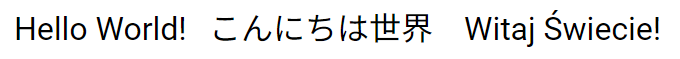
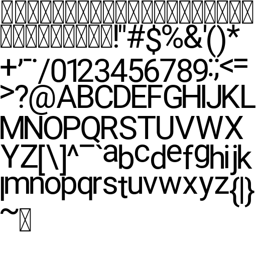
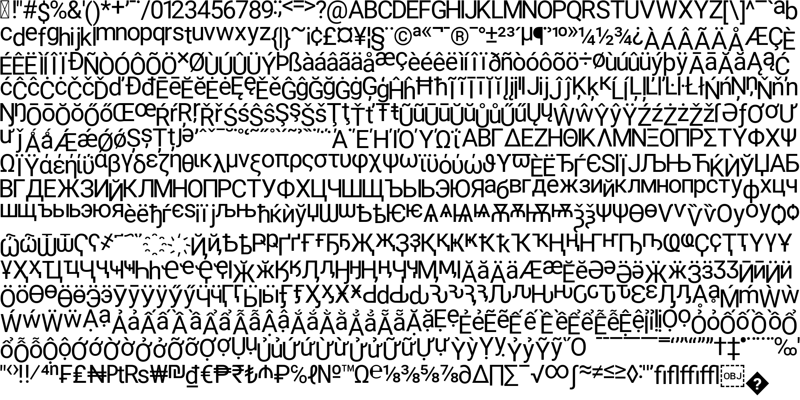

# Trex



Trex is a font rasterizer, atlas generator and text shaping library written in C++. It uses [FreeType](https://github.com/freetype/freetype) and [HarfBuzz](https://github.com/harfbuzz/harfbuzz) libraries under the hood. It provides a simple API that makes it easy to integrate high quality typography into your application.

The text rendered by this library is every pixel identical to that rendered by the Chrome and Firefox browsers. As such, Trex is an excellent choice when you need to display text in your application that, when exported to SVG or HTML format, should look identical.

## Features
* **Text Rendering** - Trex allows you to render text with FreeType, providing high-quality and accurate glyph rendering on various platforms.
* **Glyph Atlas Generation** - With Trex, you can generate efficient and minimal glyph atlases. Sides of a power of 2 are always used.
* **Text Shaping** - Trex integrates HarfBuzz to shape text, ensuring proper placement and shaping of complex scripts and languages.
* **High Performance** - The library is very fast as it relies on algorithms implemented in state-of-the-art FreeType and HarfBuzz libraries.
* **Platform Independent** - Trex is platform-independent and so are its dependencies.
* **Easy Integration** - The library provides a simple and minimalistic API, making it easy to integrate text rendering capabilities into you projects.
* **Static Library** - Trex uses CMake and it is configured as a static library.

## Basic Example

```cpp
Trex::Atlas atlas("arial.ttf", 32, Trex::Charset::Ascii());
atlas.SaveToFile("atlas.png");

Trex::TextShaper shaper(atlas);
Trex::ShapedGlyphs glyphs = shaper.ShapeAscii("Hello world!");

float cursorX = 100;
float cursorY = 100;
for (const Trex::ShapedGlyph& glyph : glyphs)
{
    float x = cursorX + glyph.xOffset + glyph.info.bearingX;
    float y = cursorY + glyph.yOffset - glyph.info.bearingY;

    int atlasGlyphX = glyph.info.x;
    int atlasGlyphY = glyph.info.y;
    int atlasGlyphWidth = glyph.info.width;
    int atlasGlyphHeight = glyph.info.height;

    // Draw a glyph at (x, y) by taking the atlas bitmap fragment
    // ... atlas.GetBitmap() ...

    cursorX += glyph.xAdvance;
    cursorX += glyph.yAdvance;
}

```

## Getting Started
To get started with Trex, follow the instructions below:

1. Clone the repository recursively: `git clone https://github.com/KyrietS/trex.git`
2. In your project's CMakeLists.txt add:
    -  `add_subdirectory(path_to_trex)` 
    - `target_link_libraries(your_project trex)`
3. Rebuild your project.
4. You can use the provided examples in the [`examples`](examples/) folder as a reference of how to use Trex.

Note: You can also use CMake's `FetchContent` module to download and configure Trex automatically.

```cmake
include(FetchContent)
FetchContent_Declare(
    trex
    GIT_REPOSITORY https://github.com/KyrietS/trex.git
    GIT_TAG        master
)
FetchContent_MakeAvailable(trex)
target_link_libraries(your_project trex)
```

## Showcase
### 512 x 512 ASCII atlas with glyphs from the [Roboto](https://fonts.google.com/specimen/Roboto) font (from 0 to 127).


### 2048 x 1024 atlas with all glyphs from the [Roboto](https://fonts.google.com/specimen/Roboto) font.


The image above was cropped manually. Trex will always generate a square atlas. In this case it would be 2048 x 2048.

## Documentation
The documentation for the Trex API can be found [here](docs/README.md).

## Dependencies

Trex has the following dependencies:

* FreeType - A high-quality font engine for rendering text.
* HarfBuzz - A text shaping engine for accurate and complex text shaping.
* stb_image_write - A header-only library for saving atlas bitmaps to PNG or BMP files.

These dependencies are fetched and configured automatically by CMake.

Examples use [raylib](https://github.com/raysan5/raylib) library to render a text on the screen.

## License
Copyright © 2023 KyrietS\
Use of this software is granted under the terms of the MIT License.

See the [LICENSE](LICENSE) file for more details.